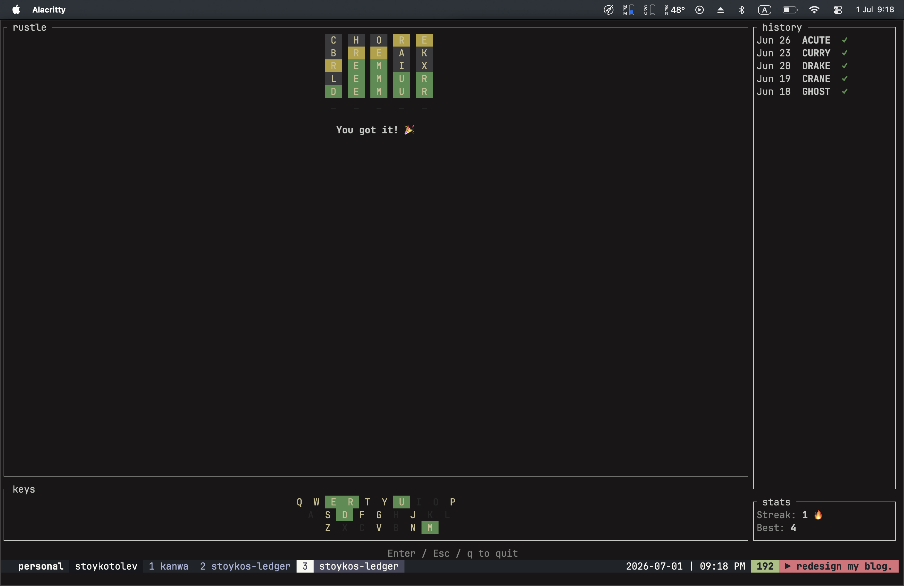
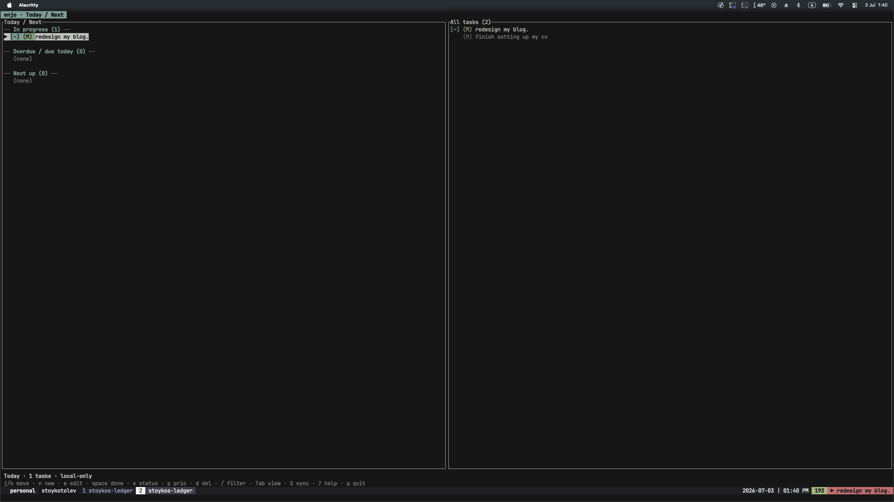
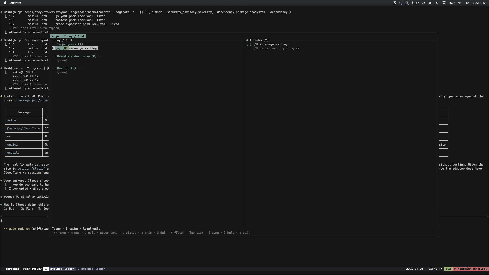

I am mostly against it.

In prod? no way, Jose.
On something where changes can have
an actual, real impact? Absolutely not.

But, in a silly little overengineered blog,
a simple TUI app or fixing personal stuff?
Yes. Give it to me.

A couple of weeks ago, I was out with a friend,
discussing this and that. And they said
"If you don't learn it now, you are actively
hindering yourself from learning a new tool."
And we can't have that, you know? Like, my whole
shtick is learning tools, how they work and then
figuring out where they shouldn't be used and
using them to help me and the process. That's
what I love about programming.

## After all, why not?
Why shouldn't I? You know.

As much as I hated to admit it, AI is here
to stay and here to shake things up. It
might not be in the way people envisioned,
or how the corps try to push it to seem like,
but it's here. And like the compilers, some
60-70 years ago, things will change. So,
might as well adapt.

And so it began. My journey into "learning
AI"

## Vibing all the way
In order to understand how something works
and how you can best use it, I think it's
important to know where its limits are.

So, I opened my silly little terminal,
with the silly little Claude CLI,
and did the silly little shift+tab dance.
Twice. For the uninitiated, that's telling
your claude session it has permission to
directly make edits, etc.

And *off I go then*. There are limits and
I'll be damned if I don't hit them. *All.
The. Time.*

## Project uno.
Back in my early days, I found out about Rust.
An amazing language, that taught me a lot
of concepts I didn't have to think about
in JS land. And I fell in love, like
most everyone that uses the language.

And as I moved to be more and more into the
terminal, using neovim (btw) and all, I
wanted to build a CLI for myself. Something
cool.

I was also a Wordle addict. You know where
this is headed already.

I did a bit of *hackering* in the Wordle website,
found out how to get the word of the day and
then I just made a very simple, very many basic
terminal app that allowed me to play Wordle. I
also added some bells and whistles to it, like
firing off confetti when you guessed the word
or playing an [amazing]() sound-bite when you lost.

And I played a bit with it, I had some bugs but
overall it worked. I was happy.

Over time, I really wanted to improve it and fix
the bugs I had. Like letter counting and proper
marking which letter you actually had at the correct
place and which not. But alas, 24 hours is never enough.

But now **I** didn't have to do it.

I fired up Claude in the repo, gave it full permissions
in the folder and gave it this prompt:
```bash
❯ i want you to review the current implementation in the repository and suggest improvements on it.
```
It gave me some pointers, but you should be familiar with
my ways at this point. This wall of text can't stop me
because I can't read. So I gave it another prompt:
```bash
i want to improve the game in the following ways: implement a way to determine if you have already played today and if you have - show a grid of your
  guesses with the letters color coded. I also want a better way to validate the word. see how the original game does it and implement somethign similar. I
  want you to run subagents for each of the separate tasks. Run the agents in the following order:
For each item, use subagents in the following way:
1. Spin a subagent to analyze the code and make a plan
2. Spin another subagent to implement this plan
3. Spin another subagent to review the code and make sure it fits the language guidelines, and fix it.
4. Spin another subagent to make sure the previous one has nailed everything

Loop 3-4 until satisfies.

Perform the tasks in order, commiting after each one is done.
```

And then I closed my terminal and
waited for it to finish.
No code reading, no review, nothing.

Once it was done, I didn't even test it.
```bash
❯ okay, now build and release a new version of this binary and publish it to crates.io
```

And damn, if it didn't feel good. It worked,
it added tests, it did everything. But it
also hit my limits. And I had so much other
cool shit I wanted to do.

$$ well spent. I am currently on the 90$ plan,
which for the moment, I can't even hit the limits on.
Which I am taking as a personal challenge.

I then added a bunch more stuff to this cool CLI.
You want UI? You got it.
You want a streak counter? You got it.
You want a cool keyboard that shows
used letters and which ones are correct
and which ones are in the wrong place?
You guessed it. You got it.

And a couple of more pushes later and now it's
so fucking cool, I'm like a school girl.
*I can't even*.

So now you can easily install it yourself:
```bash
cargo install strustle
```
(the name was taken, I can't do much about it.)

And then you get this amazing looking game in
your terminal:

Amazing.

## Project deux
I forget. A lot. ***A lot***.
And as we have established, I am a gremlin,
living in the terminal.

So I wanted to build something to help me remember.
And you've seen a small preview in the screenshot
above already.

Give it up for `Enjo`. My own personal notes app
for the terminal.

Again, fully vibecoded, just an idea and a problem
I had that I wanted to fix.

With the risk of repeating myself. **Damn**

I told it I needed the following features:
  - the tool is a TUI
  - it stores all notes locally
  - I can create/edit/delete notes
  - each note has 3 statuses: to do, in progress, done

And then it also added more functionality:
  - priority of the notes
  - due date,
  - additional notes
  - how the UI is structured

And it did deliver. Big time. The UI is nice,
the additions are cool, it picked a fitting DB,
wrote everything and after a few touches:
  - add ability to cycle priority/status back
  and forth
  - split the windows as I had too much empty
  space

it did great.



And then for the best part.

I asked it to update my tmux configuration so that
I can see it in my tmux status bar and also configure
my tmux to open it in a popup


Amazing, isn't it? It all looks so good.

It also built out a plan that it can follow in the future,
if I even need syncing between devices, etc.

## Thoughts
Overall, my opinion of AI agents greatly improved. I still
don't trust them to just write code without any oversight,
but I feel much more comfortable in letting the agent do its
own thing and steer it back once in a while.

And I especially love how much I can experiment with now, I
won't lie. The money was definitely well spent.
