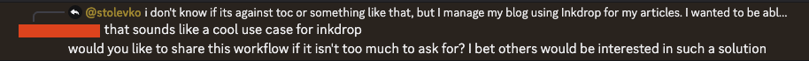

Last month, I really wanted to have images in my blog.
They are a much more expressive way to show your thoughts
and help the reader along your point.

So I started thinking on ways to achieve that.

# My setup

My current setup revolves around [Inkdrop](https://www.inkdrop.app/).
I write my blog posts there, in the form of
Markdown files,
then I move them over to this blog's repo,
where I follow my blogging template
to structure the files and have them ready
for Astro to parse and load as pages.

This is then all nicely bundled and
shipped off to Cloudflare land, where
everything is nicely hosted under their
free tier of Workers. Easy. Simple.

# My problem

Herein lies the problem -
Inkdrop stores its images, in the form
of blobs, directly inside the database.
This allows for offline use, etc.
But this makes extracting images a pain,
because I can't just grab the image link,
paste it in my blog and Bob's your uncle.
But he isn't and neither was my problem so
trivial to solve.

### First idea

My first idea was to do it all manually.
After all, how hard can it be to just...
copy the image, upload it, get the url,
update the Markdown file with the link
and only then move it to the blog.

Well, just writing it out makes me hate it.
Something like this shouldn't be this many steps.
We've already established that I am a *programmer*.
I don't do repeated tasks. And I also dislike
this process because this way the images
are stored elsewhere, potential issues,
unoptimized delivery, yada yada yada.
You get it, I get it, no need for more.

### Second idea

My next idea was to find a way to automate all of this.
A bit of back and forth with the Inkdrop docs, website
and I couldn't find anything.
But it has a server that you can use to get some stuff.
Unfortunately this doesn't include images.
And there were no plugins for this.

But nowadays, there is another actor in play. AI.

With the help of Claude, I was able to figure out
how exactly images are stored,
what the options are and what I can do.

# Our solution

The task was relatively simple.
Build a script that fetches a note,
using [Inkdrop's MCP server](https://docs.inkdrop.app/reference/mcp-server),
gets the images inside it
and stores them in the blog's repo.
It then updates all the links in the
note, so that migrating it to a blog post is seamless.

Claude, the beautiful soul, or binaries, that it is,
was helpful enough with the script. It took a couple
of prompts to get it working just how I like it,
but it got there.

And it works like a charm, honestly. [My previous post](https://stoykotolev.com/blog/entry-12/) already has images that I very much enjoy and that don't hurt the performance in any way.

See, this is an image! How cool is that.

No manual work, no repeated processes. Just a bit
of prompting and some code.

I was actually so excited I got this working, that I
shared my workflow in Inkdrop's Discord server,
where I got some great feedback on it and was even encouraged to create this post.

The repo you can find [here](https://github.com/stoykotolev/inkdrop-image-export) with the instructions and source code.

Good luck blogging!
